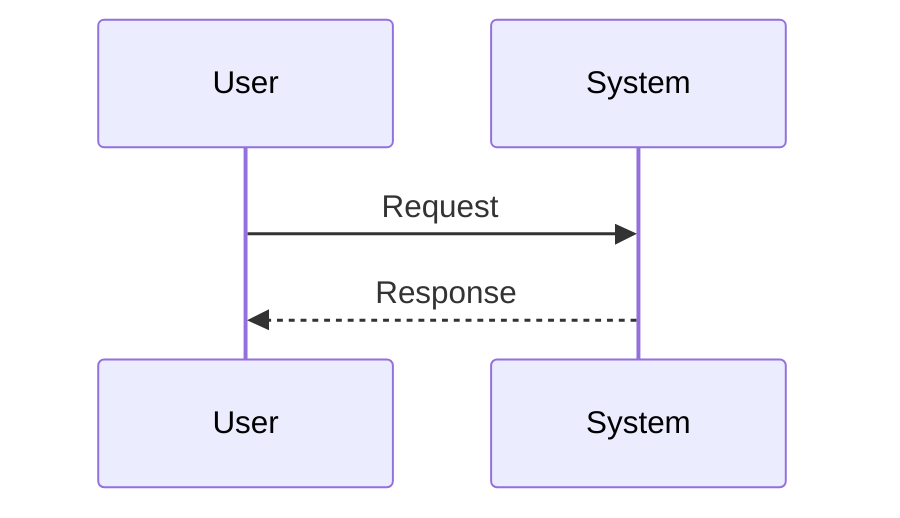

# [Spec Title]

> **TL;DR:** One sentence summary of what this feature does.

## 1. Context & User Story (Level 1+)

**As a** [user/role],
**I want** [feature/capability],
**So that** [benefit].

### Background

Why are we doing this? Link to linear tickets or previous discussions.

---

## 2. Behavioral Logic (Level 1+)

Describe the logic in plain English or pseudocode.

- **Trigger:** What starts this flow?
- **Action:** What does the system do?
- **Outcome:** What is the result?

> **Mockup/Reference:** (Insert ASCII art or link to screenshot here for Level 1)

---

## 3. Architecture & Diagrams (Level 2 Mandatory)

> **Requirement:** If this is a Level 2 Spec, you MUST include a Mermaid diagram (Sequence, State, or Class).



## 4. Interfaces & Schema (Level 2)

Define new APIs, JSON schemas, or function signatures.

```typescript
interface MyNewFeature {
  prop: string;
}
```

## 5. Risks & Security (Level 2)

- [ ] Risk 1...
- [ ] Auth check required?
