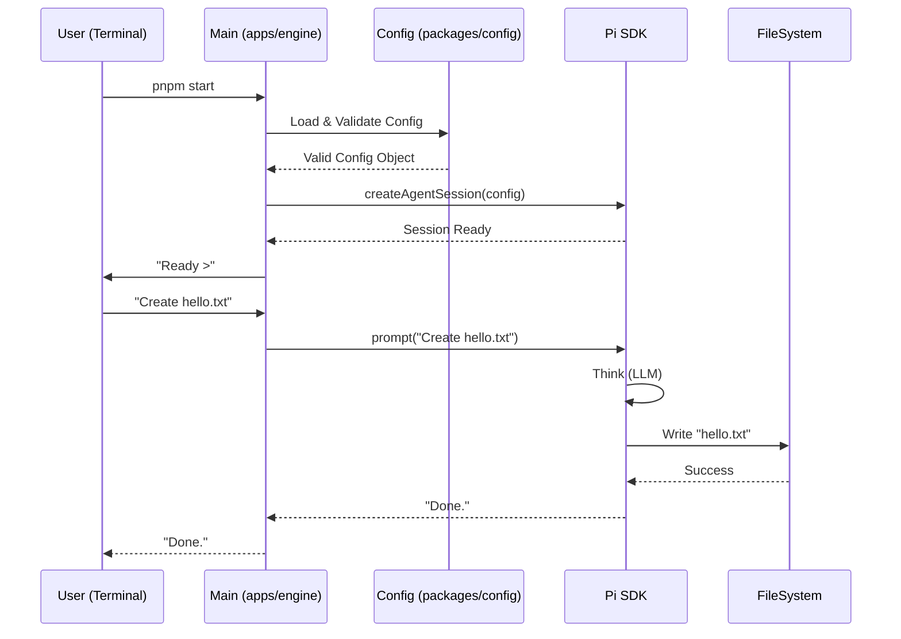

# LofiPulse Core Engine (Harness)

> **TL;DR:** The standalone Node.js runtime that wraps the Pi SDK, manages configuration, and provides the "Brain" for our agents.

## 1. Context & User Story

**As a** Developer,
**I want** a clean, type-safe wrapper around the Pi SDK,
**So that** I can run an agent reliably without dealing with raw API complexity or "fragile" JSON configs.

### Background

We are moving away from OpenClaw's monolithic approach. We need a lightweight "Kernel" that can eventually run inside an Incus container. This spec covers the **Process** itself, not the container.

---

## 2. Behavioral Logic

1.  **Boot:** The Engine starts (`src/main.ts`).
2.  **Config:** It loads `config.json` (or env vars) and validates it against `packages/config` (Zod schema). If invalid, it crashes immediately with a clear error.
3.  **Init:** It calls `createAgentSession()` from `@mariozechner/pi-coding-agent`, injecting the API Keys and Model preferences.
4.  **Loop:** It enters an Interactive Mode (REPL) or waits for RPC commands (future).
5.  **Action:** When a user types a prompt, the Engine sends it to Pi, streams the response, and executes any Tool calls (Filesystem, Bash) approved by the policy.

---

## 3. Architecture & Diagrams



## 4. Interfaces & Schema

### Engine Configuration (`packages/config`)

We will use **Zod** to define the "Contract" that every LofiPulse agent must allow.

```typescript
import { z } from "zod";

export const AgentConfigSchema = z.object({
  // Identity
  name: z.string().min(1),
  role: z.string().default("General Assistant"),

  // Brain
  model: z.enum(["anthropic/claude-3-5-sonnet", "openai/gpt-4o"]),
  temperature: z.number().min(0).max(1).default(0.7),

  // Secrets (Injected via Env, validated here)
  apiKeys: z
    .object({
      anthropic: z.string().optional(),
      openai: z.string().optional(),
    })
    .refine((data) => data.anthropic || data.openai, {
      message: "At least one API key must be provided",
    }),
});

export type AgentConfig = z.infer<typeof AgentConfigSchema>;
```

### Directory Structure (`apps/engine`)

```text
apps/engine/
├── src/
│   ├── config/         # Config loading logic
│   ├── session/        # Pi Session wrappers
│   ├── ui/             # Terminal UI (CLI/REPL)
│   └── main.ts         # Entry point
├── .env.example
├── package.json
└── tsconfig.json
```

## 5. Risks & Security

- [ ] **API Key Leakage:** Keys must NEVER be logged to the console or saved to the persistent chat history.
- [ ] **Runaway Agent:** Implement a `/stop` command to interrupt generation instantly. Use Double `Ctrl+C` to exit the TUI safely.
- [ ] **Filesystem Safety:** For Phase 1 (Local), the agent has access to the user's FS. We must ensure it only operates in the `cwd`.
