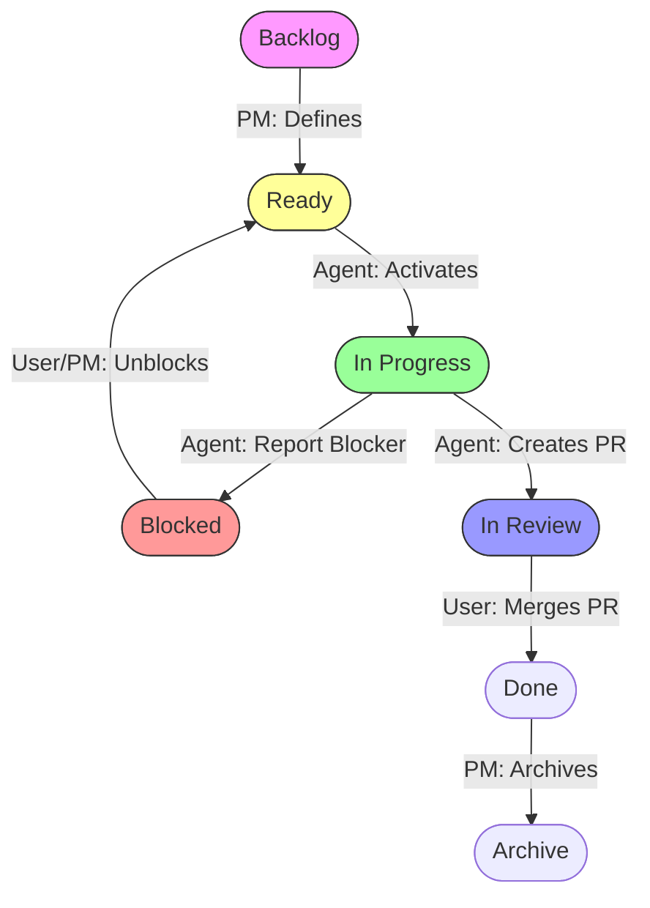

# Ops Spec: Team Workflow

## Protocol: State Gates (STRICT)

To prevent "Jumping the Gun", all Agents must adhere to these gates:

### 1. Backlog Gate (NO ENTRY)

- **State:** `Backlog`
- **Owner:** Project Manager (PM)
- **Agent Rule:** 🛑 **STOP.** You are forbidden from touching, implementing, or even planning these issues. They are "Not Ready".

### 2. Ready Gate (CHECKPOINT)

- **State:** `Ready`
- **Owner:** Project Manager -> Agent Handoff
- **Agent Rule:** ⚠️ **CHECK.** You may only pick this up if:
  1.  The status is `Ready`.
  2.  The `Agent` field matches your active Persona (e.g., "Lead Developer").
  3.  You have no other `In Progress` work (WIP Limit = 1).

### 3. Activation (EXECUTE)

- **State:** `In Progress`
- **Owner:** Agent
- **Agent Rule:** 🟢 **GO.**
  1.  Move the item to `In Progress` **BEFORE** writing a single line of code.
  2.  Create your branch (`feat/issue-ID`).
  3.  Execute the plan.

### 4. Handling Blockers (STOP THE LINE)

- **State:** `Blocked`
- **Owner:** Agent -> Project Manager / User
- **Agent Rule:** 🛑 **HALT & REPORT.**
  1.  **Update Status:** Set Status to `Blocked` (via `gh-projects`).
  2.  **Comment:** Post a comment on the Issue with:
      - **The What:** Detailed description of the blocker.
      - **The Why:** Technical limitation? Missing credential? Dependency?
      - **The Asks:** Exactly what is needed to unblock.
      - **Diagnostic:** Logs, error messages, or "best guess".
  3.  **Notify:** Trigger `notify_user` immediately with a link to the issue and a 1-sentence summary (The "Slack Ping").

### 5. Visual Workflow

---

## 1. Inception (Idea -> Backlog)

- User Request -> **Project Manager** creates GitHub Issue (Epic/Story) via `gh issue create`.
- Added to **GitHub Project** `Backlog` via `gh-projects`.
- _Validation:_ Visual check of value.

## 2. Refinement (Backlog -> Ready)

- **Project Manager** ensures Issue has all required details (Context, Acceptance Criteria).
- Moves item to `Ready` via `gh-projects --set`.
- **Definition of Ready:** Issue is fully specified and unblocked.

## 3. Activation (Ready -> In-Progress)

- **Assignee** picks up item from `Ready`.
- Moves item to `In progress` via `gh-projects --set`.
- **WIP Limit:** Focus on one item at a time.

## 4. The TDD Cycle (Red-Green-Refactor)

- **Step 1: Red (Lead QA)**
  - Write a failing test for the feature/bug.
  - Run `npm test` (it fails, or passes if empty).
  - **Commit 1:** "test: add failing test for X".
- **Step 2: Green (Lead Developer)**
  - Write the _minimum_ code to pass the test.
  - Run `npm test` (MUST PASS).
  - **Commit 2:** "feat: implement X".
- **Step 3: Refactor (Lead Developer / Architect)**
  - Clean up code, optimize, document.
  - Run `npm test` (MUST PASS).
  - **Commit 3:** "refactor: clean up X".

## 5. Verification (In-Progress -> Review)

- **Assignee** creates Pull Request via `gh-pull-request` skill.
- **Automation:**
  - Moves item to `In review` on the Board.
  - Links PR to Issue.
  - Triggers **Devin AI Review** and CI Checks.
- **Lead QA** runs final full suite (`npm test`).
- **Creative Director** checks UI/UX (if applicable).

## 6. Completion (Review -> Done)

- **Assignee** resolves all review feedback (Devin + Human).
- **User** confirms merge (`yes merge`).
- **Merge PR:** Automatically closes the linked Issue (`Closes #N`) and moves it to `Done`.

## 7. Definition of Done (Done -> Archive)

- **Project Manager** moves closed item to `Archive`.
- **Rule:** New work CANNOT start until the active slot is clear (Serial Execution).

---

**Key Rules:**

- **Serial Work:** Finish -> Archive -> Start Next.
- **WIP Limit:** 1. Focus on one thing.
- **Visual Proof:** Lofi Gate must be green before Review.
- **No Cheat:** Tests MUST exist before implementation.
