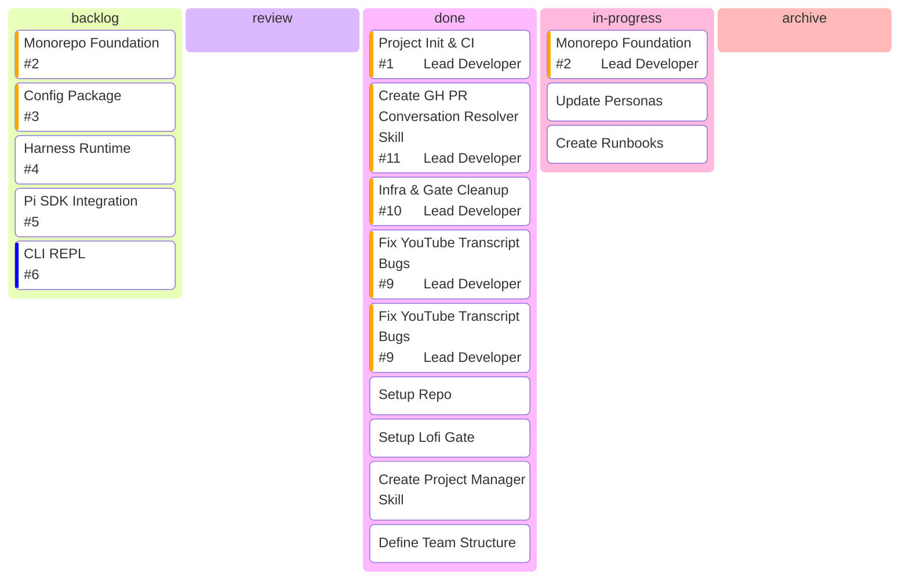

---
config:
  kanban:
    ticketBaseUrl: "https://github.com/LoFi-Monk/lofipulse/issues/#TICKET#"
---

# Project Kanban

```mermaid
kanban
  backlog
    [Monorepo Foundation]@{ ticket: '#2', priority: 'High' }
    [Config Package]@{ ticket: '#3', priority: 'High' }
    [Harness Runtime]@{ ticket: '#4', priority: 'Med' }
    [Pi SDK Integration]@{ ticket: '#5', priority: 'Med' }
    [CLI REPL]@{ ticket: '#6', priority: 'Low' }
  review
  done
    [Project Init & CI]@{ ticket: '#1', assigned: 'Lead Developer', priority: 'High' }
    [Create GH PR Conversation Resolver Skill]@{ ticket: '#11', assigned: 'Lead Developer', priority: 'High' }
    [Infra & Gate Cleanup]@{ ticket: '#10', assigned: 'Lead Developer', priority: 'High' }
    [Fix YouTube Transcript Bugs]@{ ticket: '#9', assigned: 'Lead Developer', priority: 'High' }
    [Fix YouTube Transcript Bugs]@{ ticket: '#9', assigned: 'Lead Developer', priority: 'High' }
    [Setup Repo]
    [Setup Lofi Gate]
    [Create Project Manager Skill]
    [Define Team Structure]
  in-progress
    [Monorepo Foundation]@{ ticket: '#2', priority: 'High', assigned: 'Lead Developer' }
    [Update Personas]
    [Create Runbooks]
  archive
```
