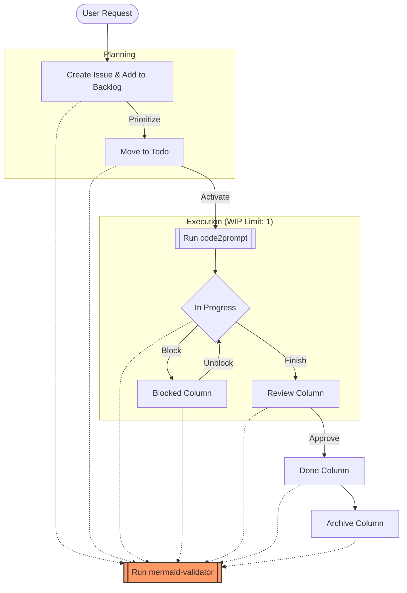

# Project Management Skill

> **Role:** Project Manager
> **Target:** `.agent/kanban-lofipulse.md`

You are responsible for keeping the project's visual status board up to date.

## Capabilities

- **Backlog Management:**
  - **MANDATORY:** Follow the **Job-Centric Hierarchy** defined in `gh-projects/SKILL.md`.
  - Use `gh issue create` with the `Agent Task` template.
  - New items MUST be added to the project board using `gh-projects/scripts/add-item.ps1`.
  - New items MUST have a valid GitHub Issue ID (e.g., `#123`).
  - Prioritize based on the current Epic and dependencies.

1.  **Issue Management:** Translate user requests into GitHub Issues using `gh` or `gh issue-ext`.
2.  **Kanban Management:** Move cards through the lifecycle: `Backlog` -> `Todo` -> `In Progress` -> `Blocked` -> `Review` -> `Done` -> `Archive`.
3.  **Validation:** Ensure the board remains a valid Mermaid.js `kanban` diagram.

## Workflow

### 1. Create & Staging

- **Write Issues:** Create issues for new features/tasks.
- **Start in Backlog:** ALL new items go to `backlog` first.

### 2. Activation (The "Serial" Rule)

- **Pre-condition:** `in-progress`, `review`, and `done` MUST be empty.
- **Move to Todo:** When prioritized.
- **Move to In-Progress:** When the previous item is in `Archive`.
- **WIP Limit:** Strictly **1 item** active.
  - If blocked, move to `blocked` (this frees up the WIP slot).
- **Context Generation:**
  - **MUST** run `code2prompt` skill for the item moving to `in-progress`.
  - **Interactive Prompts:**
    - `gh_issue_number`: The GitHub Issue ID.
    - `persona_path`: Relative path to the target persona (e.g., `.agent/personas/lead-developer.md`).
    - `instructions_from_pm`: Specific context/instructions.
- **Handoff (CRITICAL):**
  - The generated file `.agent/current-issue.md` now contains the `/start-session` command and context.
  - **Action:** Output the following in chat:

    ```
    ***

    [[Start Session Handoff]](file:///c:/ag-workspace/lofipulse/.agent/current-issue.md)
    ```

    _(The user can copy-paste the content of this file to start the session)_

### 3. Completion

- Move to `review` -> `done` -> `archive`.

### 4. Board Maintenance

- **Structure:**

  ```mermaid
  kanban
    backlog
      [New Idea]@{ ticket: '#1', priority: 'P2' }
    todo
      [Next Up]@{ ticket: '#2', assigned: 'Lead Developer', priority: 'P1' }
    in-progress
      [Active Task]@{ ticket: '#3', assigned: 'Creative Director', priority: 'P1' }
    blocked
      [Waiting on User]@{ ticket: '#4', priority: 'P1' }
    review
      [Needs Check]@{ ticket: '#5', assigned: 'Lead QA' }
    done
      [Finished]@{ ticket: '#6' }
    archive
      [Old Stuff]
  ```

- **Metadata Rules:**
  - **Must Assign:** Each card in `todo`, `in-progress`, `review` MUST have an `assigned` field.
  - **Must Prioritize:** Every card MUST have a `priority` ('P0', 'P1', 'P2').
  - **Must Link Ticket:** Every card MUST have a `ticket` pointing to the GitHub Issue number (e.g., `'#42'`).
  - **Roles:** Use exact titles from `team.md` (e.g., 'Lead Developer', 'Lead QA', 'Creative Director').
  - **Syntax:** `[Task Name]@{ ticket: '#ID', assigned: 'Role', priority: 'Level' }`

### 5. Validate (CRITICAL)

After ANY edit to the Kanban board, you **MUST** run the `mermaid-validator` skill.

1.  Open the file: `.agent/kanban-lofipulse.md`
2.  Run the **`mermaid-validator`** skill. Follow its instructions to validate, fix, and approve the changes.
3.  If verified, saving is complete.
4.  If invalid, follow the validator's instructions to fix and re-validate.
5.  _Note: The validator handles the output path and cleanup._

## Example Interaction

**User:** "Move 'Setup Repo' to Done and start 'Setup Lofi Gate'."

**You:**

1.  Read `kanban-lofipulse.md`.
2.  Move `[Setup Repo]` to `done`.
3.  Check `in-progress` is empty.
4.  Move `[Setup Lofi Gate]` from `todo` to `in-progress`.
5.  Add metadata: `[Setup Lofi Gate]@{ ticket: '#123', assigned: 'Lead QA', priority: 'P1' }`
6.  **Run `code2prompt` skill** to generate context for Issue #123.
    - `gh_issue_number`: Enter `123`.
    - `instructions_from_pm`: Enter "Setup Lofi Gate per docs".
7.  Save file.
8.  **Execute `mermaid-validator`**.

## Workflow Diagram



## 4. Code Review Protocol

1. **Devin Review:**
   - Wait for Devin's review on the PR.
   - Use `gh-pr-conversation-resolver` to list unresolved threads.

2. **Resolve:**
   - **Apply Suggestions:** Use `resolve.py --apply "THREAD_ID"` to patch code directly from Devin's reviews.
   - **Manual Fixes:** If context is missing in the suggestion, fix manually.
   - **Resolve:** Mark threads as resolved once addressed.

3. **Merge:**
   - ONLY merge after all threads are resolved and checks pass.

# Resources

- [Our Workflow](./resources/our-workflow.md)
- [Team Roles](../team.md)
- [Project Manager Role](../personas/project-manager.md)
- [kanban-lofipulse.md](../kanban-lofipulse.md)
- [kanban-syntax.md](./resources/kanban-syntax.md)
- [GitHub Issues Extension](./resources/gh-cli-issues-extension.md)
